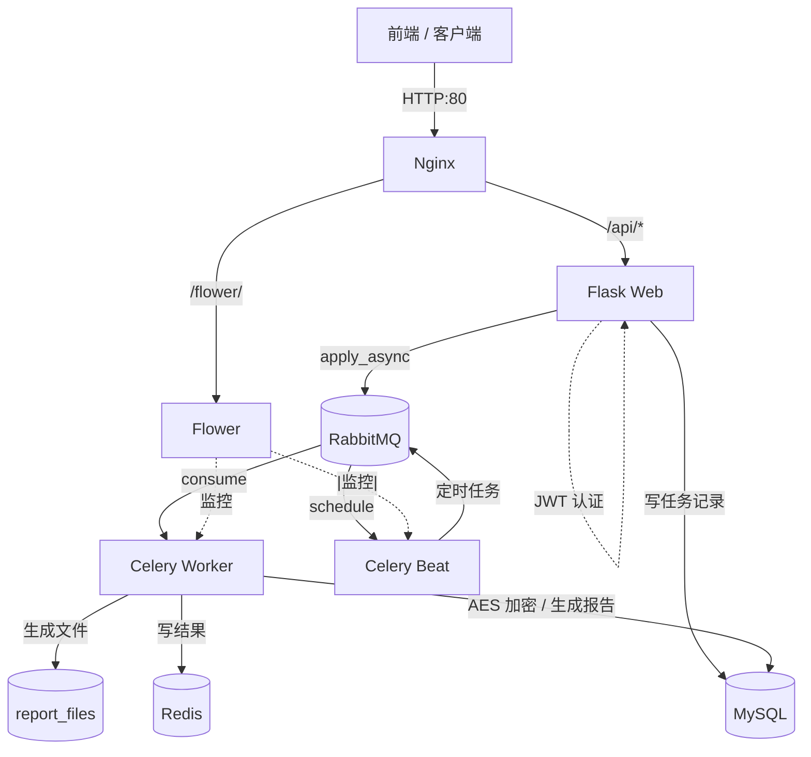

# 可靠性报告管理系统（Flask + Celery + RabbitMQ）

基于 Flask + Celery + RabbitMQ + MySQL 构建的**异步任务 + 报告管理**系统。支持用户认证（JWT 双 token）、RBAC 权限控制、AES 加密任务、多队列异步处理、报告编制/审核/归档全流程、报告版本控制、Excel/PDF 生成、Flower 监控、Nginx 反向代理、Docker Compose 一键部署。

---

## 目录

- [功能特性](#功能特性)
- [技术栈](#技术栈)
- [系统架构](#系统架构)
- [目录结构](#目录结构)
- [快速开始](#快速开始)
- [API 接口](#api-接口)
- [数据库设计](#数据库设计)
- [关键设计](#关键设计)
- [测试](#测试)
- [常见问题](#常见问题)
- [Todo / 后续优化](#todo--后续优化)

---

## 前端

访问 http://localhost/login

- 登录 / 注册
- 报告列表 / 提交 / 详情
- 版本历史 / 下载
- 审批 / 归档（admin）
- 重新生成（版本 +0.1）

## 功能特性

### 用户与权限
- **JWT 双 token**：access token（30 分钟）+ refresh token（7 天）
- **数据隔离**：`get_jwt_identity()` 保证用户只能访问自己的数据
- **RBAC 权限**：`admin` / `user` 两种角色，管理员可审批、归档、查看所有任务

### 异步任务
- **Celery 多队列**：`normal`（普通任务）、`beat`（定时任务）、`high`（高优先级）
- **任务重试 / 超时**：失败自动重试（最多 3 次），软超时 4 分钟，硬超时 5 分钟
- **任务取消**：可通过 task_id 撤销运行中的任务
- **幂等设计**：同一 `idem_key` 只处理一次
- **任务信号**：`prerun` / `postrun` / `failure` / `retry` / `revoked` 全覆盖

### 加密任务
- **AES-256-CBC** 加密用户传入的数据
- 加密结果落 MySQL，按 task_id 查询
- 支持中文

### 报告管理
- **全流程**：草稿 → 待审核 → 已审核 → 已归档
- **版本控制**：`V1.0` → `V1.1` → `V1.2`，每次生成新版本
- **报告生成**：openpyxl 生成 Excel，reportlab 生成 PDF
- **异步生成**：Celery 任务异步处理，不阻塞接口
- **文件下载**：按版本下载历史文件

### 定时任务
- **Celery Beat**：定期清理过期任务、心跳检查

### 运维
- **Docker Compose**：7 个服务一键启动
- **Flask-Migrate**：数据库版本化迁移
- **Nginx**：反向代理统一入口
- **Flower**：Celery 任务监控面板
- **pytest**：17 个单元测试覆盖核心逻辑

---

## 技术栈

| 层 | 技术 |
|---|---|
| Web 框架 | Flask 3.0 |
| ORM | SQLAlchemy + Flask-SQLAlchemy |
| 迁移 | Flask-Migrate (Alembic) |
| 认证 | Flask-JWT-Extended（双 token） |
| 序列化 | Marshmallow |
| 异步任务 | Celery 5.4 |
| 消息队列 | RabbitMQ 3.13 |
| 结果存储 | Redis 7 |
| 数据库 | MySQL 8.0 |
| 加密 | cryptography（AES-256-CBC） |
| Excel | openpyxl |
| PDF | reportlab |
| 监控 | Flower |
| 反向代理 | Nginx |
| 容器化 | Docker + Docker Compose |
| 测试 | pytest + pytest-flask |

---

## 系统架构



**数据流（提交报告）**：

```
1. 客户端 POST /api/report
2. Flask 校验 JWT + 写 Report 记录 (status=draft)
3. Flask 投递 generate_report 任务到 RabbitMQ
4. Worker 消费任务
5. Worker 生成 Excel/PDF，写 ReportVersion
6. Report.status 更新为 pending_review
7. 客户端 GET /api/report/<id> 查询
```

---

## 目录结构

```
celery_rabbitMQ/
├── app/
│   ├── __init__.py                 # 应用工厂 + Celery 配置
│   ├── config.py                   # 配置
│   ├── extensions.py               # db / jwt / migrate 实例
│   ├── models.py                   # 数据模型
│   ├── schemas.py                  # Marshmallow Schema
│   ├── crypto.py                   # AES 加解密
│   ├── routes.py                   # 认证 + 加密任务接口
│   ├── api/
│   │   └── report.py               # 报告接口
│   ├── utils/
│   │   ├── auth.py                 # RBAC 装饰器
│   │   ├── idempotent.py           # 幂等工具
│   │   └── report_builder.py       # Excel/PDF 生成
│   └── celery_tasks/
│       ├── __init__.py
│       ├── normal_tasks.py         # 普通异步任务
│       ├── beat_tasks.py           # 定时任务
│       ├── report_tasks.py         # 报告生成任务
│       └── signals.py              # Celery 信号
├── migrations/                     # Flask-Migrate 迁移
├── tests/                          # pytest 测试
│   ├── conftest.py
│   ├── test_auth.py
│   ├── test_crypto.py
│   └── test_encrypt.py
├── nginx/
│   └── nginx.conf                  # Nginx 配置
├── run.py                          # 启动入口
├── requirements.txt
├── Dockerfile
├── docker-compose.yml
├── pytest.ini
├── .dockerignore
├── .gitignore
└── README.md
```

---

## 快速开始

### 前置要求

- Docker Desktop（Windows / macOS）或 Docker Engine（Linux）
- Docker Compose v2
- 内存建议 4G+

### 启动

```bash
# 1. 克隆项目
git clone https://github.com/你的用户名/celery-rabbitmq-report.git
cd celery-rabbitmq-report

# 2. 启动所有服务
docker compose up -d --build

# 3. 等待 30 秒，确认服务健康
docker compose ps

# 4. 初始化数据库（首次运行）
docker compose exec web flask db upgrade
docker compose exec web flask init-roles

# 5. 验证
curl http://localhost/api/health
```

### 访问入口

| 服务 | 地址 | 账号 |
|---|---|---|
| API | http://localhost/api/ | - |
| Flower | http://localhost:5555 | - |
| RabbitMQ 管理 | http://localhost:15672 | appuser / apppass |
| MySQL | localhost:3306 | appuser / apppass |

### 快速体验

```bash
# 1. 注册（第一个用户自动是 admin）
curl -X POST http://localhost/api/auth/register \
  -H "Content-Type: application/json" \
  -d '{"username":"alice","password":"123456"}'

# 2. 登录拿 token
curl -X POST http://localhost/api/auth/login \
  -H "Content-Type: application/json" \
  -d '{"username":"alice","password":"123456"}'

# 3. 提交加密任务（带 access_token）
curl -X POST http://localhost/api/encrypt \
  -H "Content-Type: application/json" \
  -H "Authorization: Bearer <access_token>" \
  -d '{"data":"hello world"}'

# 4. 查结果（用返回的 task_id）
curl http://localhost/api/encrypt/<task_id> \
  -H "Authorization: Bearer <access_token>"

# 5. 提交报告
curl -X POST http://localhost/api/report \
  -H "Content-Type: application/json" \
  -H "Authorization: Bearer <access_token>" \
  -d '{"title":"可靠性测试报告","content":"样品A 测试通过","format":"xlsx"}'

# 6. 查报告
curl http://localhost/api/report/1 \
  -H "Authorization: Bearer <access_token>"
```

---

## API 接口

### 认证

| 方法 | 路径 | 说明 | 权限 |
|---|---|---|---|
| POST | `/api/auth/register` | 注册 | 公开 |
| POST | `/api/auth/login` | 登录（返回双 token） | 公开 |
| POST | `/api/auth/refresh` | 刷新 access token | 需 refresh token |
| GET | `/api/auth/me` | 当前用户信息 | 需 access token |

### 加密任务

| 方法 | 路径 | 说明 | 权限 |
|---|---|---|---|
| POST | `/api/encrypt` | 提交加密任务 | 登录 |
| GET | `/api/encrypt/<task_id>` | 查询加密结果 | 登录（本人） |
| POST | `/api/encrypt/<task_id>/cancel` | 取消任务 | 登录（本人） |
| GET | `/api/tasks` | 任务列表（分页） | 登录（本人） |
| GET | `/api/admin/tasks` | 所有任务 | admin |

### 报告

| 方法 | 路径 | 说明 | 权限 |
|---|---|---|---|
| POST | `/api/report` | 提交报告（异步生成） | 登录 |
| GET | `/api/report` | 报告列表 | 登录（本人） |
| GET | `/api/report/<id>` | 报告详情 | 登录（本人） |
| GET | `/api/report/<id>/versions` | 版本列表 | 登录（本人） |
| POST | `/api/report/<id>/submit-review` | 草稿 → 待审核 | 登录（本人） |
| POST | `/api/report/<id>/approve` | 待审核 → 已审核 | admin |
| POST | `/api/report/<id>/archive` | 已审核 → 已归档 | admin |
| POST | `/api/report/<id>/regenerate` | 重新生成（版本 +0.1） | 登录（本人） |
| GET | `/api/report/<id>/download/<version>` | 下载文件 | 登录（本人） |

---

## 数据库设计

### 核心表

| 表 | 说明 |
|---|---|
| `user` | 用户 |
| `role` | 角色（admin / user） |
| `user_role` | 用户-角色关联 |
| `encrypt_task` | AES 加密任务 |
| `idempotent_record` | 幂等记录 |
| `report` | 报告主表 |
| `report_version` | 报告版本（每版本一个文件） |

### 关键索引

| 索引 | 表 | 字段 | 用途 |
|---|---|---|---|
| `idx_user_status` | `encrypt_task` | (user_id, status) | 按用户 + 状态查询 |
| `idx_report_user_status` | `report` | (user_id, status) | 按用户 + 状态查询 |
| `idx_report_version` | `report_version` | (report_id, version) | 按报告 + 版本查询 |

---

## 关键设计

### 1. Celery 配置必须在模块顶层

worker 启动命令是 `celery -A app:celery worker`，它**只 import `app` 模块，不调用 `create_app()`**。因此 Celery 的 broker / queue / beat_schedule 配置必须放在 `app/__init__.py` 的模块顶层，不能放在 `create_app()` 里。

### 2. 任务装饰器用 `@celery.task`

`@shared_task` 依赖 "current app"，可能创建默认 Celery 实例（broker 变成 `127.0.0.1`）。`@celery.task` 明确绑定自己的实例，避免踩坑。

### 3. 任务里访问数据库要 `with app.app_context()`

worker 进程没有 Flask 上下文，操作 `db.session` 会报 `Working outside of application context`。`ContextTask` 自动给每个任务套上 app context。

### 4. JWT 双 token

- `access_token`：短期（30 分钟），用于业务接口
- `refresh_token`：长期（7 天），用于换新 access_token

好处：access_token 泄露影响小，refresh_token 可撤销。

### 5. 数据隔离

`get_jwt_identity()` 拿 user_id，所有查询都加 `filter_by(user_id=uid)`，保证用户只能访问自己的数据。

### 6. 报告版本控制

每次生成新版本都新增一条 `ReportVersion` 记录，版本号 `V1.0` → `V1.1` → `V1.2`，文件路径分开存，历史版本可下载。

### 7. 幂等设计

通过 `idem_key` 唯一索引，重复插入报 `IntegrityError` 表示重复请求。

### 8. 测试隔离

测试用 `sqlite:///:memory:`，`create_app()` 里加：

```python
if app.config["SQLALCHEMY_DATABASE_URI"].startswith("sqlite"):
    app.config["SQLALCHEMY_ENGINE_OPTIONS"] = {}
```

避免 SQLite 拿到 MySQL 专属的连接池参数。

---

## 测试

```bash
# 跑全部测试
docker compose exec web pytest -v

# 跑单个文件
docker compose exec web pytest tests/test_auth.py -v

# 看覆盖率（需装 pytest-cov）
docker compose exec web pytest --cov=app tests/
```

**测试覆盖**：
- AES 加解密往返
- JWT 注册 / 登录 / 刷新 / 401
- 数据隔离（用户 A 查不到用户 B 的数据）
- RBAC（admin / user 权限）
- 报告提交 / 查询

**预期**：`17 passed`

---

## 常见问题

### Q1: `pytest` 把 MySQL 表删了？

`conftest.py` 里 app fixture 必须传 `sqlite:///:memory:`，且 `create_app` 里对 SQLite 清空 `SQLALCHEMY_ENGINE_OPTIONS`。

### Q2: worker 报 `unregistered task`？

`app/celery_tasks/__init__.py` 里要 import 所有任务模块，`app/__init__.py` 底部也要 import。

### Q3: 迁移版本冲突？

```bash
# 删掉版本记录，重新标记
docker compose exec mysql mysql -uappuser -papppass reportdb -e "DROP TABLE alembic_version;"
docker compose exec web flask db upgrade
```

### Q4: 报告一直 PENDING？

看 worker 日志：
```bash
docker compose logs -f worker
```
可能原因：任务没注册、broker 连不上、任务报错。

### Q5: 表丢了？

**别用 `docker compose down -v`**，`-v` 会删 volume。用：
```bash
docker compose down
docker compose up -d --build
```

---

## Todo / 后续优化

- [ ] gunicorn 替换 `python run.py`（生产 WSGI）
- [ ] Dockerfile 加非 root 用户
- [ ] 加 Prometheus + Grafana 监控
- [ ] 加日志聚合（ELK / Loki）
- [ ] 支持报告模板自定义
- [ ] 批量导出报告
- [ ] 部署到 K8s

---

## License

MIT